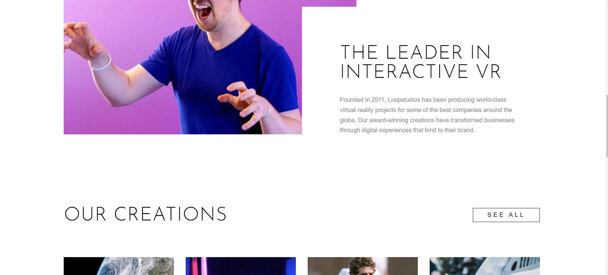
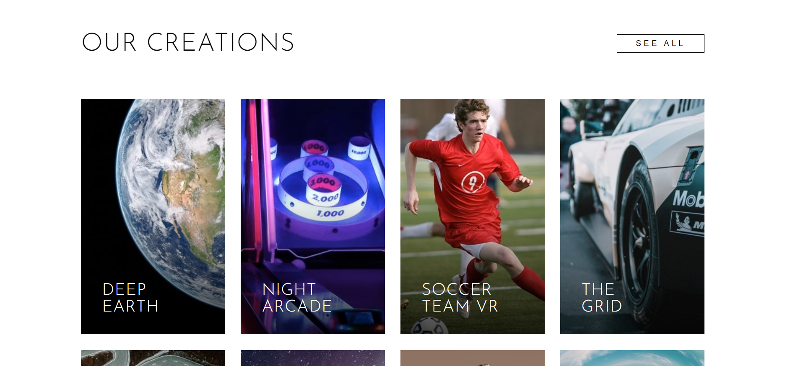
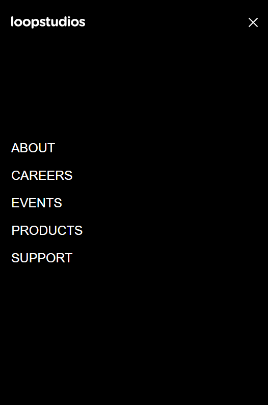
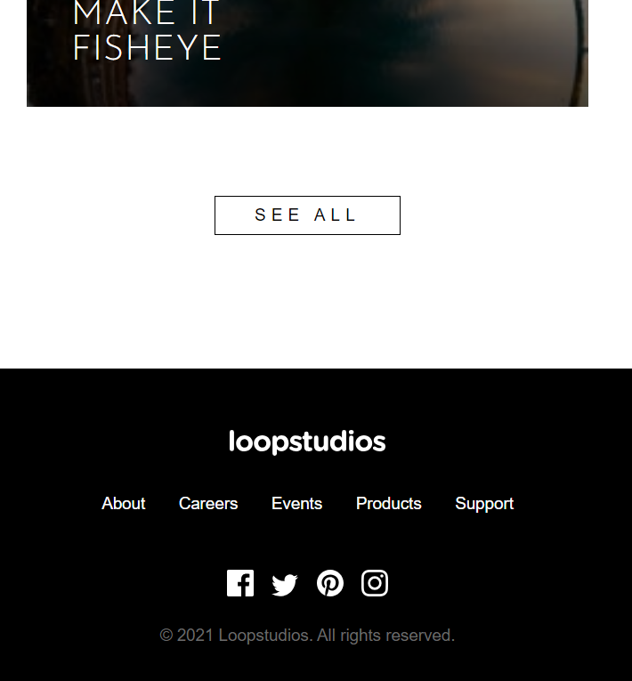

# Loopstudios landing page solution

This repository hosts the source code for a modern, responsive design landing page template. Tailored for creatives, designers, and agencies, this template is built with HTML5, CSS3, and JavaScript, ensuring a seamless and engaging user experience across all devices. The landing page features a clean, minimalistic design with a focus on typography and imagery, making it perfect for showcasing portfolios, projects, or brand stories.

Key Features:

Fully responsive layout for mobile, tablet, and desktop
Elegant, modern design with a focus on content
Easy to customize with well-structured code
SEO-friendly markup for better search engine ranking
Whether you're launching a new project, creating an online portfolio, or looking to upgrade your website's appearance, this design landing page template offers a sophisticated starting point that can be adapted to meet your needs.

### The challenge

This landing page is designed to showcase Loopstudios - Coding Challenge from FrontEnd Mentor.

Users should be able to:

- View the optimal layout for the site depending on their device's screen size
- See hover states for all interactive elements on the page

### Screenshot

### Links

- Solution URL: [Add solution URL here](https://your-solution-url.com)
- Live Site URL: [Add live site URL here](https://your-live-site-url.com)

## My process

### Built with

- Semantic HTML5 markup
- CSS3 styling, including variables.css for CSS variables, main.css for main styling, and media_queries.css for responsive design adjustments
- Flexbox
- CSS Grid
- Mobile-first workflow
- Vanilla JavaScript for interactive behaviors

### Structure

index.html: The main HTML document.
script.js: Contains JavaScript for interactive features.
main.css, media_queries.css, variables.css: CSS files for styling and responsiveness.

### What I learned

This project was a fantastic opportunity to hone my skills in responsive design, particularly using CSS Grid and Flexbox.

### Useful resources

MDN Web Docs - An invaluable resource for understanding HTML, CSS, and JavaScript concepts.
CSS Tricks - Great for deep dives into Flexbox and Grid layouts.

## Author

[Miriam Sparbrod]

- Projects on Github Website - [Miriam Sparbrod](https://github.com/MiriamS284)
- Frontend Mentor - [@MiriamS284](https://www.frontendmentor.io/profile/MiriamS284)
